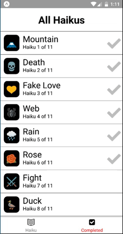

# Hi-Q: Learn Japanese through Haiku

A cross-platform mobile application built using React Native.

## DEMO

## Features

Each line of a Haiku is displayed in original Japanese. You are able to hear the line being spoken and then presented with three possible English, literal translations.

Once all lines are correctly chosen, a poetic translation is shown.

Progress is saved automatically with Async Storage.

## Download

[iOS version](https://itunes.apple.com/cn/app/shu-du-zhong-shi-chun-cui/id1138612488)

[Android version](http://a.app.qq.com/o/simple.jsp?pkgname=com.liteneo.sudoku)

## Future releases

1. More Haiku lessons
2. Subscription model
3. Multiple users
